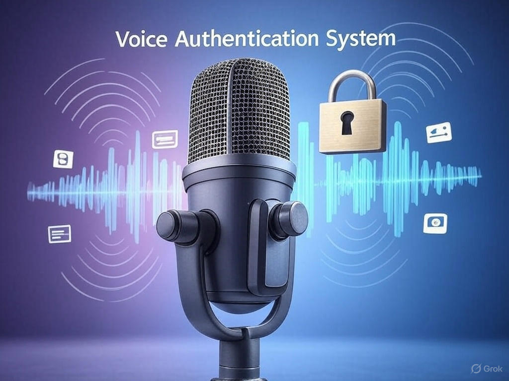
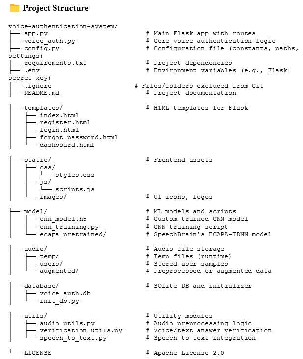
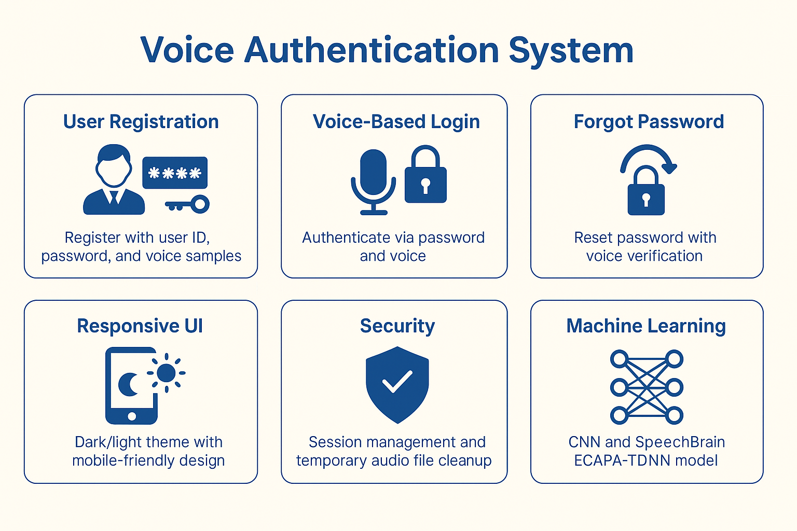
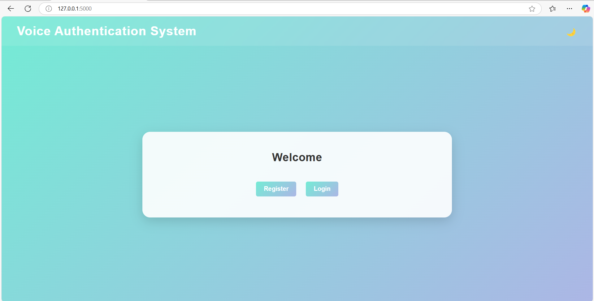
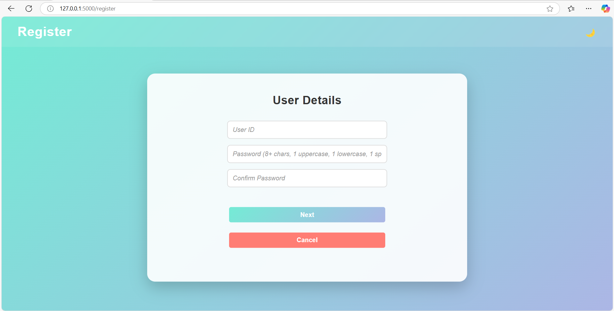
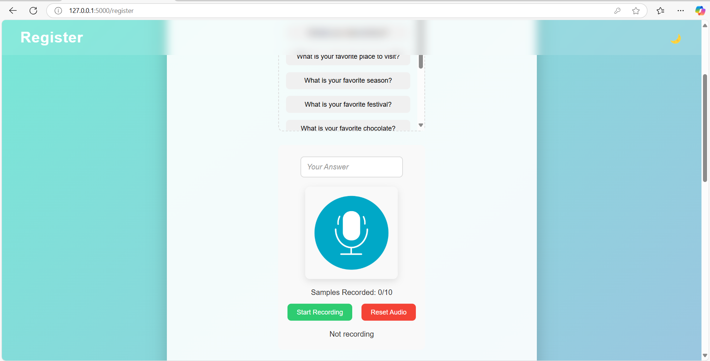
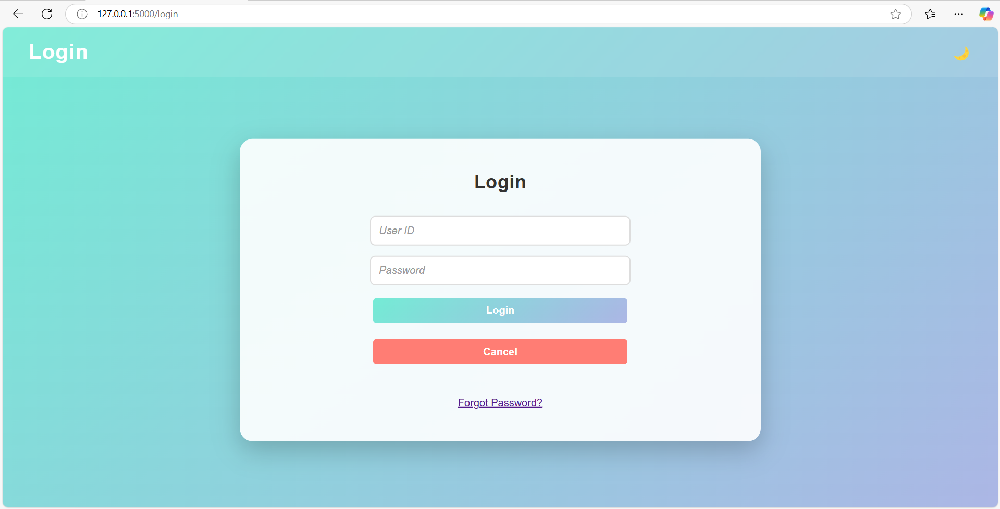
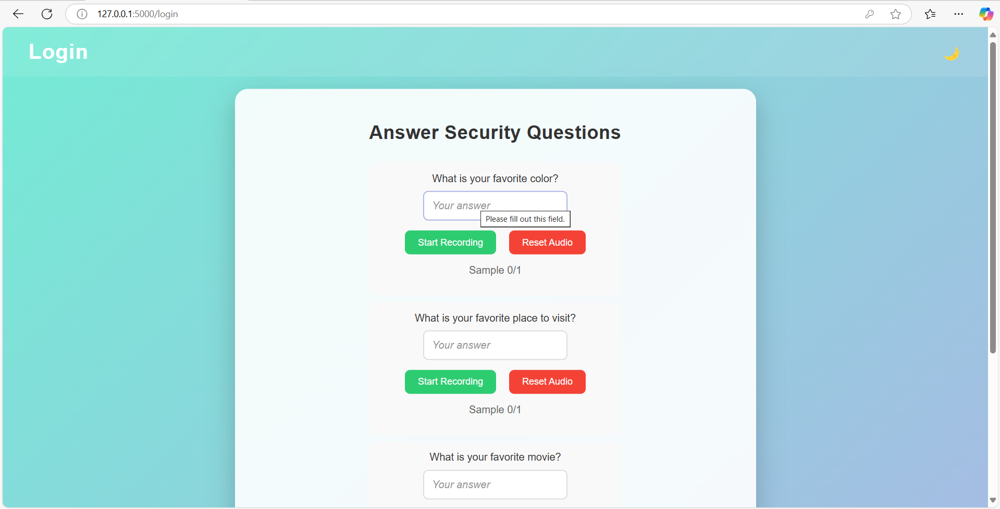
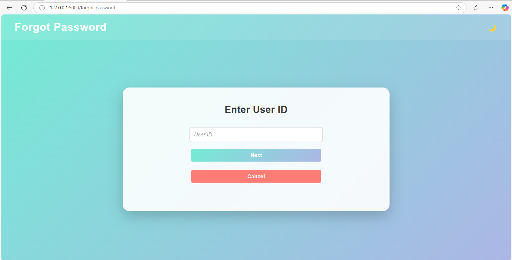
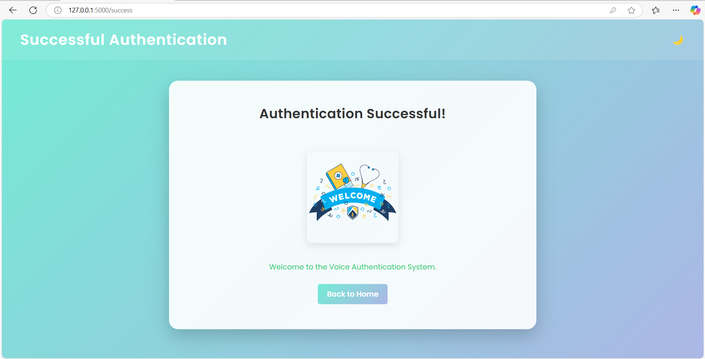

# 🎙️ Voice Authentication System

 <p align="center">
     
   </p>

A secure, web-based Voice Authentication System that combines password-based authentication, voice biometrics, and security question verification to provide a robust user authentication mechanism. Users register with their voice samples, answer security questions, and authenticate using voice recognition powered by machine learning. This project was developed as a final-year project to demonstrate advanced concepts in web development, audio processing, and machine learning.

This project implements a voice-based authentication system that integrates speaker recognition, speech content verification, and text-based password validation. It leverages deep learning models for speaker identification and speech classification, with a SQLite database to manage user data, audio samples, and voice embeddings.

---

 <p align="center">
     
   </p>

---

## 📖 Project Overview
 <p align="center">
     
   </p>

The Voice Authentication System enhances traditional password-based login systems by incorporating voice biometrics. Users register by providing a user ID, password, and recording voice samples for three security questions. During login, users verify their identity using a password and voice input. A forgot-password feature allows password reset via voice verification.

---

## ✨ Highlights:

- **Web Development**: Flask-based responsive web application.  
- **Audio Processing**: Real-time audio handling via `SpeechRecognition` and `Librosa`.  
- **Machine Learning**: Voice verification using SpeechBrain’s ECAPA-TDNN and a custom CNN.  
- **Database**: User and voice data stored in SQLite.  
- **Security**: Password strength validation, session management, and safe file handling.

---

## ✨ Features
- **User Registration**: Create accounts with unique IDs, passwords, security questions, and voice samples.  
- **Login Authentication**: Verify users via password and voice-based answers to security questions.  
- **Forgot Password**: Recover accounts by answering security questions with voice verification.  
- **Password Reset**: Securely update passwords after verification.  
- **Speaker Recognition**: Uses SpeechBrain's ECAPA-TDNN for voice embedding generation.  
- **Speech Classification**: Trains a custom CNN to classify spoken answers.  
- **Text Verification**: Validates typed and spoken answers using text similarity.  
- **Audio Processing**: Converts audio to mel-spectrograms and applies augmentation (noise, pitch shift). 

### 🔐 User Registration:
- Unique user ID and strong password.
- Select 3 security questions and answer them with 10 voice samples each.

### 🔊 Voice-Based Login:
- Authenticate via password + voice answers to security questions.
- One voice sample per question for verification.
- Login by answering 3 security questions with voice, it needs 2/3 Match for successful login.

### 🔁 Forgot Password:
- Reset password by answering 3 security questions with voice, it needs 3/3 Match for successful login

### 🎨 Responsive UI:
- Dark/light theme toggle.
- Mobile-friendly, gradient-based design.

### 🔒 Security:
- Password strength indicator.
- Session-based access control.
- Temporary audio files auto-deleted post-verification.

### 🤖 Machine Learning:
- Pretrained ECAPA-TDNN for voice embeddings.
- Custom CNN on mel-spectrograms for answer verification.

### 🔄 Feedback:
- Real-time sample status and processing spinners.

---

## 🛠️ Tech Stack

### Backend:
- Python 3.8  
- Flask 2.0.1  
- SQLite  

### Frontend:
- HTML5  
- CSS3  
- JavaScript  

### Machine Learning & Audio:
- SpeechBrain 0.5.10  
- TensorFlow 2.8.0  
- Librosa 0.8.1  
- SpeechRecognition 3.8.1  
- SoundFile 0.10.3  
- NumPy 1.21.0  
- PyTorch 1.10.0  

---

## 🚀 Installation

### Prerequisites
- Python 3.8+  
- Git  
- Microphone  
- (Optional) GPU for model acceleration  

### Steps

1. **Clone the Repository**:
   ```bash
   git clone https://github.com/[YourUsername]/voice-authentication-system.git
   cd voice-authentication-system
   ```

2. **Install Dependencies**:
   ```bash
   pip install -r requirements.txt
   ```

   `requirements.txt` should include:
   ```
   flask==2.0.1
   speechrecognition==3.8.1
   soundfile==0.10.3
   numpy==1.21.0
   librosa==0.8.1
   tensorflow==2.8.0
   torch==1.10.0
   speechbrain==0.5.10
   python-dotenv==0.20.0
   ```

   **Note:**  
   Install `PyAudio` separately:
   ```bash
   pip install pyaudio
   ```

3. **Set Environment Variables**:
   Create a `.env` file:
   ```
   FLASK_SECRET_KEY=your_secure_key
   ```

   Generate a key using:
   ```python
   import secrets
   print(secrets.token_hex(16))
   ```

4. **Run the App**:
   ```bash
   python app.py
   ```

5. **Access**:  
   Go to [http://localhost:5000](http://localhost:5000)

---

## 📝 Usage

### 1. Initialize the System
```python
from voice_auth import VoiceAuth
auth = VoiceAuth()
```

### 2. Register a User
```python
user_id = "test_user"
password = "SecurePass123!"
questions = ["What is your favorite color?", "What is your pet's name?", "What is your birthplace?"]
answers = [["Blue"], ["Max"], ["New York"]]
audio_files = [
    ["path/to/audio1.wav", ..., "path/to/audio10.wav"],
    ["path/to/audio11.wav", ..., "path/to/audio20.wav"],
    ["path/to/audio21.wav", ..., "path/to/audio30.wav"]
]
success, message = auth.register(user_id, password, questions, answers, audio_files)
print(message)
```

### 3. Login
```python
success, message, questions = auth.login(user_id, password)
if success:
    print("Login successful. Answer the following questions:", questions)
else:
    print(message)
```

### 4. Verify Answers (Login or Forgot Password)
```python
answers = ["Blue", "Max", "New York"]
audio_files = ["path/to/login_audio1.wav", "path/to/login_audio2.wav", "path/to/login_audio3.wav"]
success, message = auth.verify(user_id, answers, audio_files, is_login=True)
print(message)
```

### 5. Reset Password
```python
new_password = "NewSecurePass123!"
success, message = auth.reset_password(user_id, new_password)
print(message)
```

## 🗄️ Database Schema
- **users**: Stores user ID and password.  
- **questions**: Stores security questions per user.  
- **answers**: Stores answers to security questions.  
- **audio_samples**: Stores paths to audio samples (registration/login).  
- **embeddings**: Stores serialized voice embeddings.  
- **user_mapping**: Maps user IDs to unique labels for classification.

## 🎙️ Audio Processing
- **Sample Rate**: 22,050 Hz  
- **Duration**: 5 seconds per sample  
- **Mel-Spectrograms**: 64 mel bands, 1024 FFT, 512 hop length  
- **Augmentation**: Noise addition and pitch shifting for training  
- **Energy Threshold**: 0.0001 to filter silent audio  

## 🤖 Models
- **Speaker Recognition**: SpeechBrain's pre-trained ECAPA-TDNN (`spkrec-ecapa-voxceleb`) for voice embeddings.  
- **Speech CNN**: Custom per-user CNN for answer classification:
  - 2 Conv2D layers (8 and 16 filters)
  - MaxPooling layers
  - Dense layers with dropout
  - Softmax output for 3 question classes

## 🔒 Security
- **Password Requirements**: Minimum 8 characters, including uppercase, lowercase, numbers, and special characters.  
- **Voice Verification**:
  - Cosine similarity ≥ 0.55 for voice embeddings  
  - Speech CNN confidence ≥ 0.7 for answer classification  
  - Text similarity ≥ 0.9 for typed/spoken answers  

- **Login**: Requires 2/3 correct answers  
- **Password Reset**: Requires 3/3 correct answers

## 📜 Logging
- Stored in `voice_auth.log` with timestamp, level, and message.  
- Tracks registration, login, verification, and errors.

## ⚠️ Limitations
- Requires internet for Google Speech-to-Text API.  
- Audio quality impacts verification accuracy.  
- Minimum 10 audio samples per question for registration.

---

## 🖼️ Screenshots
- Home Page
     <p align="center">
  
   </p>
- Registration
  <p align="center">
  
   </p>
   <p align="center">
     
   </p>
- Login  
   <p align="center">
     
   </p>
   <p align="center">
     
   </p>
- Forgot Password  
   <p align="center">
     
   </p>
- Dashboard  
   <p align="center">
     
   </p>

---

## ⚙️ Challenges and Solutions

**Challenge:** Accurate voice recognition in noisy environments.  
**Solution:** Implemented ambient noise adjustment using SpeechRecognition’s `adjust_for_ambient_noise` and an energy threshold check (`ENERGY_THRESHOLD = 0.0001`) to filter out silent recordings.

**Challenge:** Handling large audio files and model training.  
**Solution:** Used SpeechBrain’s pretrained ECAPA-TDNN model to reduce training time and a lightweight CNN for question-specific verification. Audio files are resampled to 16kHz for efficiency.

**Challenge:** Ensuring text and voice answer alignment.  
**Solution:** Integrated Google Speech-to-Text for spoken answer verification and used `SequenceMatcher` for text similarity (threshold ≥ 0.9).

**Challenge:** Secure storage of sensitive data.  
**Solution:** Stored passwords in plaintext (to be improved with hashing) and excluded `temp/`, `users/`, and `voice_auth.db` from Git using `.gitignore`.

**Challenge:** Model adaptability and up-to-date embeddings.  
**Solution:** The system retrains the custom CNN model and updates the user’s speaker embeddings each time the user logs in successfully. This helps keep the model in sync with recent voice patterns, improving authentication accuracy over time.

---

## 🔮 Future Improvements

- 🔐 Password hashing with bcrypt  
- 🔑 Add OTP-based MFA (email/SMS)  
- 🎧 Advanced noise cancellation  
- ☁️ Deploy to Heroku, Render, or AWS  
- 🧪 Add unit testing with `pytest`  
- ♿ Improve accessibility with ARIA labels  
- 📊 Track login attempts with analytics  
- 🚀 Optimize ECAPA-TDNN or use lightweight alternatives  
- 🛠️ Admin panel for user logs  
- 🎙️ Real-time audio feedback with progress indicators
---

## 📜License

This project is licensed under the [Apache License 2.0](LICENSE).

## 📬Contact

- **Author:** K. Lokesh Kumar
- **Email:** lokeshkumarkona07@gmail.com  
- **LinkedIn:** (https://www.linkedin.com/in/kona-lokesh-kumar-57b658344)

⭐ Star this repository if you find it useful!

Thanks for checking out the Voice Authentication System! 🚀  
